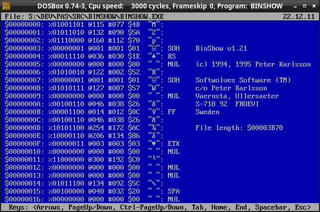

BINSHOW
=======

I wrote this in 1994, being frustrated that I couldn't find any good
software for looking at files as binary dumps for MS-DOS.

Now, many decades later, I am making the source code available for everyone.

Please note that the address and phone number in the binary is no longer
valid.